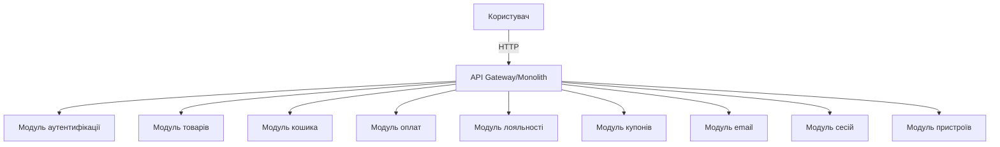
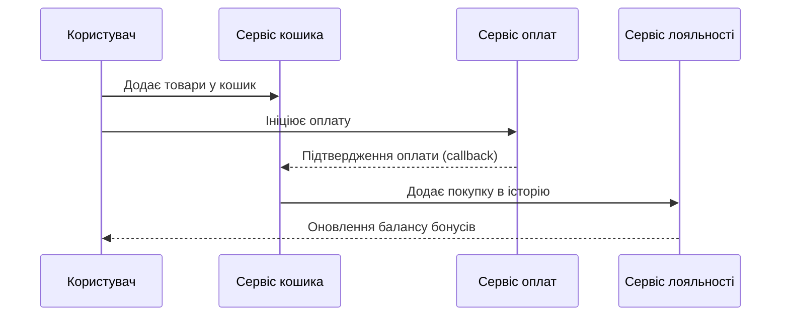
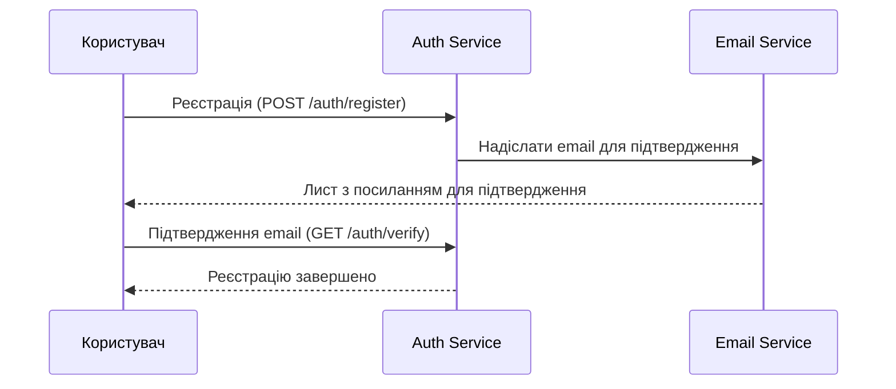

# Огляд Архітектури Проєкту

## 1. Архітектурний стиль

Проєкт використовує підхід **Modular Monolith** на базі фреймворку NestJS. Кожна бізнес-область інкапсульована у власному модулі, що забезпечує підтримуваність і масштабованість. Архітектура багаторівнева: контролери, сервіси, DTO, схеми, спільні утиліти.

## 2. Шаблони проєктування
- **Dependency Injection (DI):** Вбудовано у NestJS для всіх сервісів і контролерів.
- **Repository Pattern:** Абстракція доступу до даних (через Mongoose-моделі).
- **Service Layer:** Бізнес-логіка інкапсульована у сервісах.
- **DTO/Валідація:** Всі вхідні/вихідні дані валідовані через DTO та class-validator.
- **Controller-Service-Repository:** Чітке розділення відповідальностей.
- **Factory/Strategy/Adapter:** Можуть бути додані для розширюваності (наприклад, оплата, лояльність).

## 3. Структура папок і модулів

```
src/
  core/           # Глобальні фільтри, пайпи, інтерсептори, middleware
  common/         # Спільні утиліти, декоратори, enum, інтерфейси, логери
  user/           # Користувачі (user.module.ts, user.service.ts, user.controller.ts, dto/, schema/)
  auth/           # Аутентифікація та авторизація
  product/        # Каталог товарів
  cart/           # Кошик
  payment/        # Оплати
  loyalty/        # Лояльність, бонуси, історія покупок
  coupon/         # Купони та знижки
  email/          # Email-сповіщення
  session/        # Сесії
  device/         # Керування пристроями
  main.ts         # Точка входу
```
- Кожен домен — окремий модуль з контролером, сервісом, схемою, DTO, тестами.
- Спільна логіка — у `common/` та `core/`.

## 4. Архітектурні рішення (ADR)

- **ADR-001: Modular Monolith**
  - Обрано для швидкої розробки, підтримуваності та можливості подальшого переходу до мікросервісів.
- **ADR-002: NestJS Framework**
  - Забезпечує DI, модульність, масштабованість.
- **ADR-003: MongoDB (Mongoose)**
  - Гнучка схема, підходить для e-commerce та швидких ітерацій.
- **ADR-004: Багаторівнева структура**
  - Розділення відповідальностей для підтримуваності та тестованості.
- **ADR-005: Валідація DTO**
  - Всі API-входи/виходи валідовані та документовані для безпеки й прозорості.

## 5. Оглядова діаграма системи



## 6. Приклад потоку даних: оформлення замовлення



## 7. Якісні атрибути
- **Функціональність:** Модульність, кожен домен інкапсулює свою логіку.
- **Зручність:** Зрозумілий API, документація через Swagger.
- **Надійність:** Валідація, обробка помилок, логування.
- **Підтримуваність:** Модульна структура, легко розширювати й підтримувати.
- **Продуктивність:** Асинхронні операції, масштабована база MongoDB.
- **Масштабованість:** Можливість переходу до мікросервісів.

## 8. Підсумок
Ця архітектура забезпечує надійну, підтримувану та масштабовану основу для e-commerce backend. Modular monolith дозволяє швидко розробляти та легко мігрувати до мікросервісів у майбутньому. Всі архітектурні рішення задокументовані для прозорості та швидкого онбордингу.

## 9. Sequence Diagram: Реєстрація користувача



## 10. Інтеграції з зовнішніми сервісами

- **Email Service:** Для надсилання сповіщень, підтвердження email, інформації про замовлення. Інкапсульовано в модулі `email`, легко замінити або розширити (SMTP, Brevo, Sendgrid тощо).
- **Платіжні провайдери:** Модуль `payment` абстрагує роботу з оплатами. Інтеграція з зовнішніми платіжними шлюзами (наприклад, LiqPay) через сервіси та callback-и.
- **Керування пристроями:** Модуль `device` для відстеження пристроїв користувачів (безпека, аналітика).
- **Сесії:** Модуль `session` для керування сесіями, можна розширити для розподіленого зберігання. 