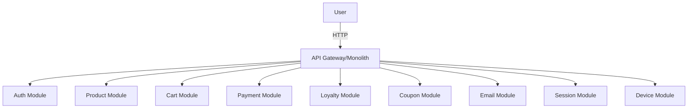
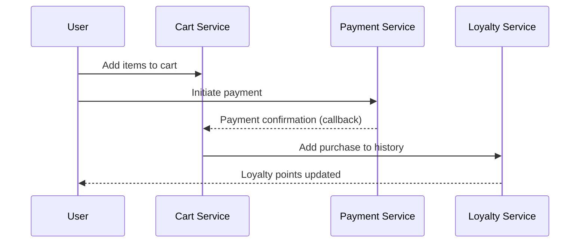
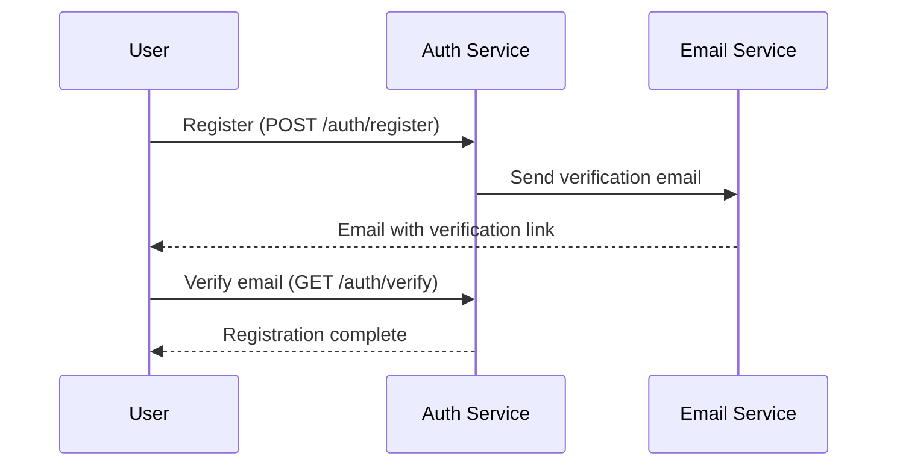

# Project Architecture Overview

## 1. Architectural Style

The project follows a **Modular Monolith** approach using the NestJS framework. Each business domain is encapsulated in its own module, which allows for maintainability and future scalability. The architecture is layered, separating concerns into controllers, services, DTOs, schemas, and shared utilities.

## 2. Design Patterns
- **Dependency Injection (DI):** Provided by NestJS for all services and controllers.
- **Repository Pattern:** Used for data access abstraction (via Mongoose models).
- **Service Layer:** Business logic is encapsulated in service classes.
- **DTO/Validation:** All input/output data is validated and described via DTOs and class-validator.
- **Controller-Service-Repository:** Clear separation of concerns.
- **Factory/Strategy/Adapter:** Can be introduced for extensibility (e.g., payment, loyalty strategies).

## 3. Folder and Module Structure

```
src/
  core/           # Global filters, pipes, interceptors, middlewares
  common/         # Shared utilities, decorators, enums, interfaces, loggers
  user/           # User domain (user.module.ts, user.service.ts, user.controller.ts, dto/, schema/)
  auth/           # Authentication and authorization
  product/        # Product catalog
  cart/           # Shopping cart
  payment/        # Payment processing
  loyalty/        # Loyalty, bonuses, purchase history
  coupon/         # Coupons and discounts
  email/          # Email notifications
  session/        # Session management
  device/         # Device management
  main.ts         # Application entry point
```
- Each domain is a self-contained module with its own controller, service, schema, DTOs, and tests.
- Shared logic and cross-cutting concerns are in `common/` and `core/`.

## 4. Architectural Decision Records (ADR)

- **ADR-001: Modular Monolith**
  - Chosen for rapid development, maintainability, and ease of refactoring to microservices if needed.
- **ADR-002: NestJS Framework**
  - Provides DI, modularity, and out-of-the-box support for scalable architecture.
- **ADR-003: MongoDB (Mongoose)**
  - Flexible schema, suitable for e-commerce and rapid iteration.
- **ADR-004: Layered Structure**
  - Separation of concerns for maintainability and testability.
- **ADR-005: DTO Validation**
  - All API inputs/outputs are validated and documented for safety and clarity.

## 5. System Overview Diagram



## 6. Data Flow Example: Order Placement



## 7. Quality Attributes
- **Functionality:** Modular, each domain encapsulates its logic.
- **Usability:** Clear API, documented via Swagger.
- **Reliability:** Validation, error handling, and logging.
- **Supportability:** Modular structure, easy to extend and maintain.
- **Performance:** Asynchronous operations, scalable MongoDB backend.
- **Scalability:** Can be split into microservices if needed.

## 8. Summary
This architecture provides a robust, maintainable, and scalable foundation for an e-commerce backend. The modular monolith approach allows for rapid development and easy future migration to microservices. All architectural decisions are documented for transparency and onboarding.

## 9. Sequence Diagram: User Registration



## 10. External Integrations

- **Email Service:** Used for sending notifications, verification emails, and order confirmations. Encapsulated in the `email` module, can be replaced or extended for different providers (SMTP, Brevo, Sendgrid, etc.).
- **Payment Providers:** The `payment` module abstracts payment processing. Integration with external payment gateways (e.g., LiqPay) is handled via service classes and callbacks.
- **Device Management:** The `device` module can be used for tracking user devices, useful for security and analytics.
- **Session Management:** The `session` module manages user sessions, can be extended for distributed session storage. 